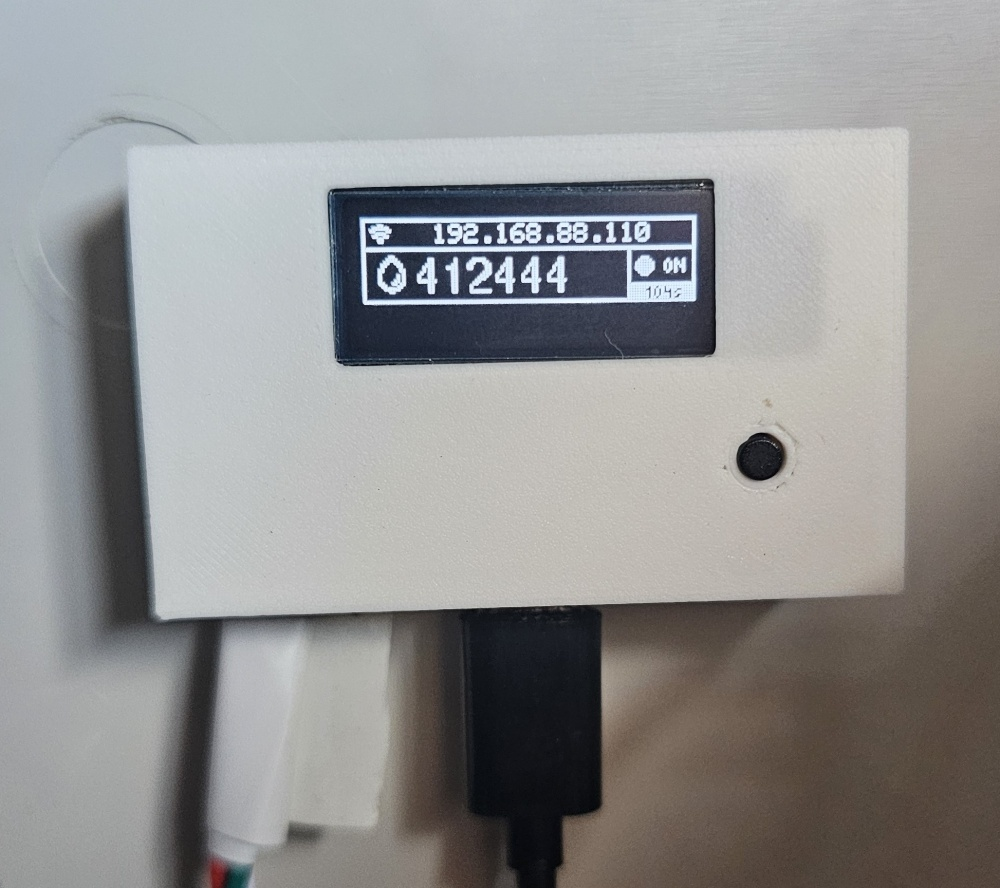
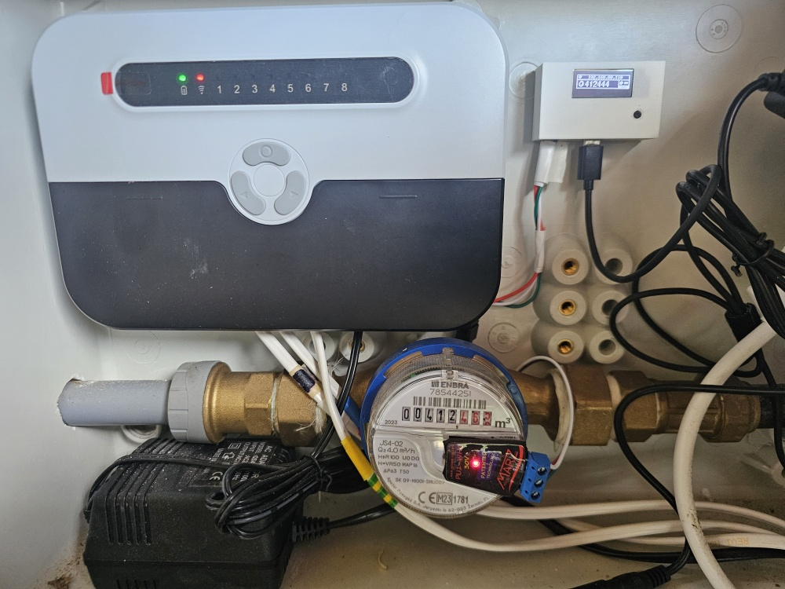
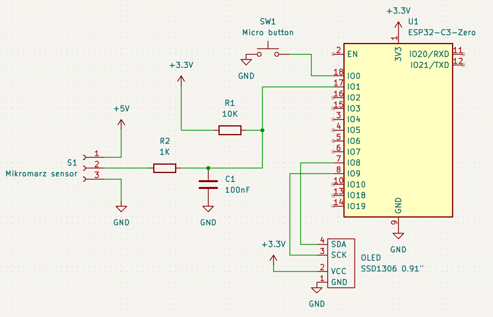
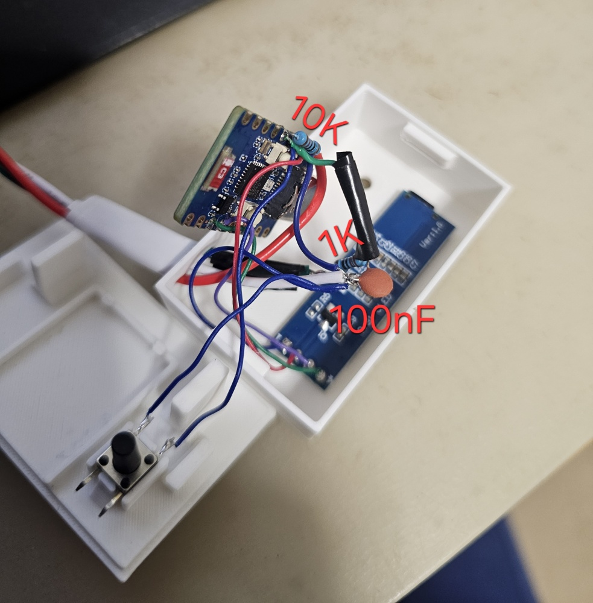
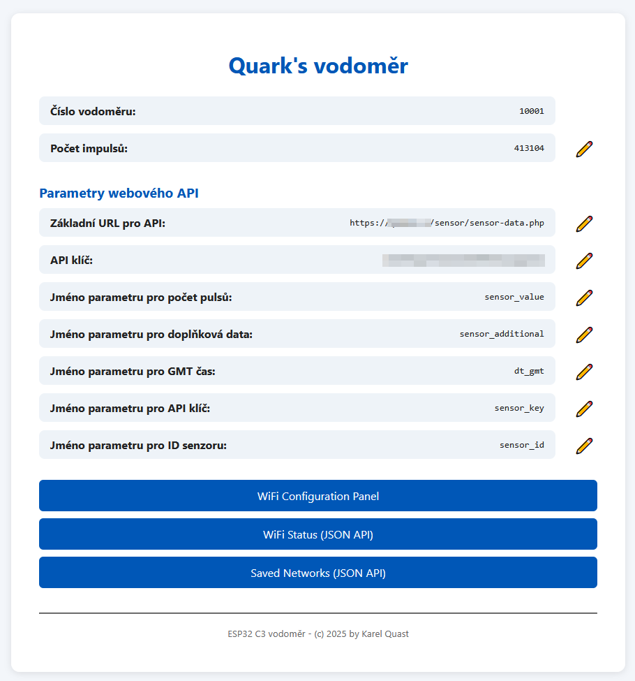

# Watermeter ESP32 C3
Water meter based on ESP32-C3 - connected to sensor with impulse output.

Published under **[CC BY-NC 4.0](https://creativecommons.org/licenses/by-nc/4.0/legalcode.txt)**

This project was created to have home-made water metering based on [Mikromarz pulse sensor](https://www.mikromarz.com/www-mikromarz-cz/eshop/50-1-Vodomery/172-1-Bytove-vodomery/5/898-Impulsni-modul-pro-vodomery-ENBRA-ER-AM). This sensor requires 5V input, sends a 3.3V logic output signal and is built as open-drain solution (standard output is 3.3V, when impulse, output pin is pulled to GND). If you have a different sensor, feel free to adjust the input part/code. If you have the same one, I recommend to do at least the basic input filtering as I did - tested for several months and works perfect. To have a full control over collected data, software in ESP is not calling directly HomeAssistant, but customizable API. In my case I have a PHP script on my VPS that water meter ESP is connecting to. This PHP script stores the data to MySQL database, where it's read by another PHP script returning raw data and with Python script I get finally a JSON for my HomeAssistant. **Sorry for the complicated architecture - you can of course make it easier - I've used already existing platforms I have access to and since my original solution was connected to Mikromarz cloud, I've reused part of the code reading from the original cloud.**

```
Architecture:
Water sensor -> Water meter -> PHP API -> MySQL -> PHP script -> Python script ->  Home Assistant
```

<a href="docs/watermeter-detail.jpg"></a>
<a href="docs/watermeter.jpg"></a>

## Required components
* [ESP32 C3 Zero](https://es.aliexpress.com/item/1005006583420105.html)
* [OLED display 0.91"](https://es.aliexpress.com/item/1005008918700196.html)
* Resistors 1k&Omega;, 10k&Omega;
* Capacitor 100nF
* [Micropush button 6x6x12](https://es.aliexpress.com/item/1005006046180384.html)
* Wires

## Flashing ESP32
Code is written with Arduino architecture, but I've used VS Code with PlatformIO to upload it. LittleFS is used for storing HTML and CSS
1. General -> Full Clean
2. General -> Build (to test if your libraries and dependencies downloaded)
3. Platform -> Build file system image
4. Platform -> Upload file system image
5. Update source code `src/main.cpp` based on your needs (default server/api/...)
6. Build and upload code

## HW assembly
After the firmware upload, disconnect ESP32 and it's time to make HW part.
Ideally print the Enclosure from [3D model published in 3MF](3d/Watermeter%20ESP32%20C3%20zero%20box.3mf). 
<a href="3d/Watermeter%20ESP32%20C3%20zero%20box.png"></a>

Overall schematics:


For filtering input signals - eliminating ghost readings, one of the working (tested) methods is to use schematics ^^^. For connecting the HW, you need to solder two resistors and capacitor + connect the display and microbutton. One of the possible ways that'll fit into the 3D model minimalistic box:

<a href="docs/inside-box-values.jpg"></a>

Connection to Mikromarz sensor is simple:
* 5V from ESP32 USB
* GND connected to ESP32 GND
* Pulse connected to 1k resistor (see schematics)

## API part (PHP + MySQL/MariaDB + Python)
For API, I've used simple MySQL/MariaDB tables and PHP script to write data and to read data. Then Python script to return JSON for Home Assistant. 
1. On your server create database for sensors ([table structures](php/sensors-db-structure.sql))
2. Update credentials in PHP scripts `php/sensor-data.php` and `php/sensor-read.php` (in both scripts `mysqli('localhost', 'db_user', 'db_pass', 'db_name');`)
3. Configure your HTML server (i.e. Apache) to execute PHP scripts
4. Create alias for Python script (+ setup webserver to execute Python). For Apache, configuration is like this
````
  <Directory /var/www/html/voda>
    WSGIApplicationGroup %{GLOBAL}
    Order deny,allow
    allow from all	
  </Directory>
  WSGIScriptAlias /voda_spotreba /var/www/html/voda/spotreba.py
````

## First run
If you did everything correctly, after a first run (USB connected), the display will show you SSID and Password for Wifi to connect to. Use your phone/computer to connect to this network and setup your home wifi. After that, you'll see assigned IP on the display.
Connect to this IP and finish the setup - set parameters for API, keys, ...


*Note:*
For setting up different sensor ID, there's a special URL to change that - not available from GUI. 
`http://192.168.xx.yy/api/syssetup?key=your_calculated_sha3_256_in_hex_build_in_code&vodomer_id=0001`
In this example, `192.168.xx.yy` means your water meter's IP address and `your_calculated_sha3_256_in_hex_build_in_code` is a hash of your secret key stored in `main.cpp` in `/api/syssetup` section.

## Home Assistant integration
If you have working server part (you can call i.e. `https://your-server.com/voda_spotreba` and it returns JSON), you can simple integrate water meter to your Home Assistant by adding following lines to configuration.yaml:
```
rest:
  - resource: https://your-server.com/voda_spotreba
    method: GET
    scan_interval: 300   # every 5 min
    timeout: 8
    sensor:
      - name: "Water home"
        unique_id: water_home
        value_template: "{{ value_json.spotreba_24h | int }}"  # what you want as main entity
        unit_of_measurement: "L"
        device_class: volume
        json_attributes:
          - min_date
          - max_date
          - date_diff_h
          - min_value
          - max_value
          - spotreba_celkem
          - date_from_2h
          - date_to_2h
          - spotreba_2h
          - date_from_12h
          - date_to_12h
          - spotreba_12h
          - date_from_24h
          - date_to_24h
          - spotreba_24h
```

## Final words
I know, architecture could be simpler, as I wrote at the beginning, this has it's historical reason. If you would have time to write PHP script to return JSON like python script does, feel free to contact me, I'd be happy to skip Python part and add your script here with attribution :-)
